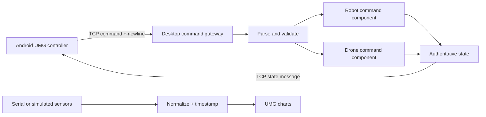

# UE5 Blueprint Diagnostics & LAN Control Lab

An evidence-oriented Codex skill and practical engineering handbook for Unreal Engine 5 Blueprint projects. It explains how to diagnose Blueprint failures, organize an asset-heavy project, visualize sensor data, package an Android controller, and connect that controller to a desktop UE application over a local network.

This repository contains **documentation and independently reproducible examples only**. It does not contain the original projects, packaged applications, Marketplace assets, private logs, machine paths, credentials, or personal information.

## Start here

| Goal | Guide |
| --- | --- |
| Understand the inspected project without receiving its source | [Redacted project case study](docs/ue5/REDACTED_PROJECT_CASE_STUDY.md) |
| Build Android-to-desktop control | [LAN remote-control Blueprint recipe](docs/ue5/LAN_REMOTE_CONTROL.md) |
| Define messages safely | [Control protocol](docs/ue5/CONTROL_PROTOCOL.md) |
| Package and test Android | [Android packaging guide](docs/ue5/ANDROID_PACKAGING.md) |
| Build a drone and sensor dashboard | [Drone and sensor workflow](docs/ue5/DRONE_SENSOR_WORKFLOW.md) |
| Diagnose common Blueprint faults | [Common failures](docs/ue5/COMMON_FAILURES.md) |
| Install the Codex skill | [Skill entrypoint](skills/ue5-blueprint-troubleshooter/SKILL.md) |

## Reference architecture



The Android application sends intent, not direct unrestricted object access. The desktop application owns the simulation state, validates every message, applies movement on the game thread, and returns state or errors.

## What is verified

The case study is based on read-only inspection of two UE projects associated with UE 5.4 and package artifacts for Windows and Android. Selected UMG Blueprints compiled in the editor. Binary asset metadata confirmed TCP client calls, connection and receive delegates, IP/port input, press/release controls for motion and robot joints, camera controls, a drone pawn, chart data, and serial/Arduino references.

The repository does **not** claim that every hidden Blueprint path was reproduced end to end. Each guide marks observations, recommended reconstruction, and verification steps separately.

## Codex skill

Copy `skills/ue5-blueprint-troubleshooter` into your Codex skills directory and refresh Codex.

Example:

```text
Use $ue5-blueprint-troubleshooter to design and verify an Android-to-desktop TCP control graph in UE5.
```

## Release boundary

MIT licensed original documentation and examples only. Unreal Engine, third-party plugins, and third-party assets retain their own licenses. See [OPEN_SOURCE_BOUNDARY.md](docs/OPEN_SOURCE_BOUNDARY.md).
