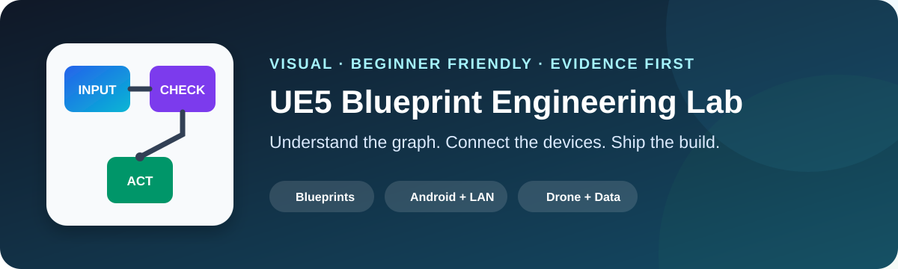
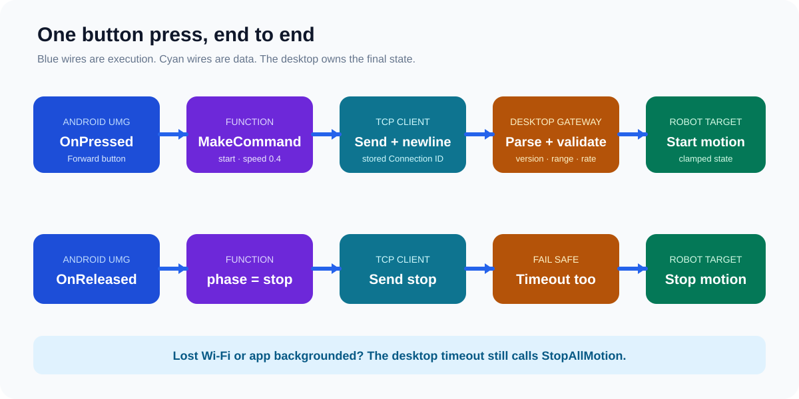
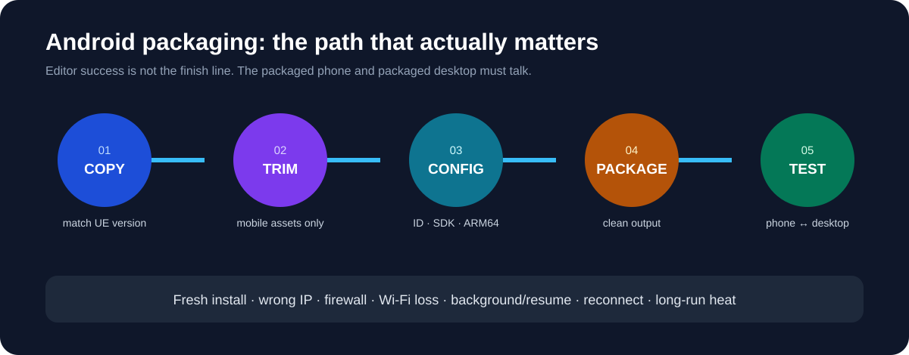

  

  
  
  
  

<strong>Blueprint debugging · Android ↔ Desktop · Drone · Sensors · Packaging</strong>

Visual guides and a Codex skill. No original project, private log, APK, or third-party asset.

## Choose your path

| 📱 Build remote control | 🚁 Build drone + data | 🧩 Read verified nodes | 📦 Ship Android |
| --- | --- | --- | --- |
| [Phone → desktop, node by node](docs/ue5/LAN_REMOTE_CONTROL.md) | [Sensors → charts → HUD](docs/ue5/DRONE_SENSOR_WORKFLOW.md) | [Actual graph → purpose → guard](docs/ue5/NODE_LIBRARY.md) | [Copy → configure → package → test](docs/ue5/ANDROID_PACKAGING.md) |

  

## Beginner route

### 1 — Understand the idea

The phone sends **intent**. The desktop validates it, changes the simulation, and sends state back.

### 2 — Build one safe button

~~~text
OnPressed → MakeCommand(start) → Send TCP
OnReleased → MakeCommand(stop)  → Send TCP
~~~

### 3 — Package both sides

  

### 4 — Test the failure paths

<code>wrong IP</code> · <code>firewall</code> · <code>Wi-Fi loss</code> · <code>phone backgrounded</code> · <code>server restart</code>

## What came from the inspected projects?

**Observed:** TCP client calls, connection/receive delegates, IP and port input, press/release controls, Base + JointA–JointE, camera switching, drone Pawn, charts, and serial/Arduino references.

**Rebuilt for this repository:** the public protocol, safe server architecture, validation rules, diagrams, naming, and test plan.

[Open the evidence report →](docs/ue5/PROJECT_EVIDENCE_REPORT.md) · [Browse the node library →](docs/ue5/NODE_LIBRARY.md)

> **Release blocker found:** the private source project contained a credential in a Blueprint default. The value is excluded here; it must be revoked and removed before any project package is shared. [Read the remediation guide →](docs/ue5/SECURITY_REMEDIATION.md)

<strong>Install the Codex skill</strong>

Copy <code>skills/ue5-blueprint-troubleshooter</code> into your Codex skills directory and refresh Codex.

~~~text
Use $ue5-blueprint-troubleshooter to explain this Blueprint and give me the smallest reproducible test.
~~~

[Open the skill →](skills/ue5-blueprint-troubleshooter/SKILL.md)

<strong>Repository map</strong>

~~~text
docs/ue5/                              Visual engineering guides
docs/media/                            Original SVG diagrams
skills/ue5-blueprint-troubleshooter/   Installable Codex skill
scripts/                               Link, privacy, and skill checks
~~~

<strong>Evidence and privacy boundary</strong>

This repository does not claim that every hidden Blueprint path was reproduced end to end. Plugin node names can vary. Package and two-device tests remain required.

Original <code>.uasset</code>, <code>.umap</code>, Windows builds, APKs, Marketplace content, logs, tokens, addresses, and personal information are excluded. See [the release boundary](docs/OPEN_SOURCE_BOUNDARY.md).

Original documentation and diagrams: MIT. Unreal Engine and third-party components retain their own licenses.

