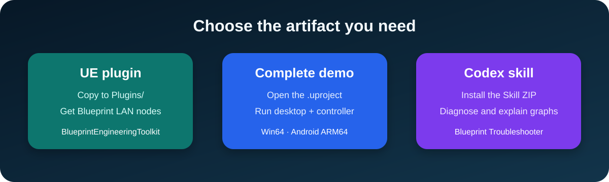

  

  
  
  
  
  

<strong>Blueprint debugging · Android ↔ Desktop · Drone · Sensors · Packaging</strong>

Visual guides, a Codex skill, and a clean-room UE 5.4 source demo. No original project, private log, APK, or third-party asset.

## Choose your path

| 📱 Build remote control | 🚁 Build drone + data | 🧩 Read verified nodes | 📦 Ship Android |
| --- | --- | --- | --- |
| [Phone → desktop, node by node](docs/ue5/LAN_REMOTE_CONTROL.md) | [Sensors → charts → HUD](docs/ue5/DRONE_SENSOR_WORKFLOW.md) | [Actual graph → purpose → guard](docs/ue5/NODE_LIBRARY.md) | [Copy → configure → package → test](docs/ue5/ANDROID_PACKAGING.md) |

  

## Run something now

  

| Use the UE plugin | Open the complete demo | Use the Codex skill |
| --- | --- | --- |
| Copy `BlueprintEngineeringToolkit` into a project's `Plugins` folder | Open [`UE5LanControlDemo.uproject`](examples/ue5-lan-control-demo/UE5LanControlDemo.uproject) in UE 5.4 | Download the Skill ZIP from Releases |

[Open the runnable demo →](examples/ue5-lan-control-demo/README.md)

## Beginner route

### 1 — Understand the idea

The phone sends **intent**. The desktop validates it, changes the simulation, and sends state back.

### 2 — Build one safe button

~~~text
OnPressed → MakeCommand(start) → Send TCP
OnReleased → MakeCommand(stop)  → Send TCP
~~~

### 3 — Package both sides

  

### 4 — Test the failure paths

<code>wrong IP</code> · <code>firewall</code> · <code>Wi-Fi loss</code> · <code>phone backgrounded</code> · <code>server restart</code>

## What came from the inspected projects?

**Observed:** TCP client calls, connection/receive delegates, IP and port input, press/release controls, Base + JointA–JointE, camera switching, drone Pawn, charts, serial/Arduino references, a Windows Shipping executable, and an Android ARM64 Shipping APK with install artifacts.

**Completion evidence:** both project descriptors record UE 5.4; package artifacts are present on the inspected workstation, and the maintainer confirms the packaged Android-to-desktop LAN workflow was completed on real devices.

**Rebuilt for this repository:** the public protocol, safe server architecture, validation rules, diagrams, naming, and test plan.

[Open the evidence report →](docs/ue5/PROJECT_EVIDENCE_REPORT.md) · [Browse the node library →](docs/ue5/NODE_LIBRARY.md)

> **Security boundary resolved for this release:** a historical credential finding was removed from the inspected source copies and is absent from this repository and its reachable Git history. Original packages and private logs remain excluded. [Read the remediation guide →](docs/ue5/SECURITY_REMEDIATION.md)

<strong>Install the Codex skill</strong>

Download the installable ZIP from the latest GitHub Release, or copy <code>skills/ue5-blueprint-troubleshooter</code> into your Codex skills directory and refresh Codex.

~~~text
Use $ue5-blueprint-troubleshooter to explain this Blueprint and give me the smallest reproducible test.
~~~

[Open the skill →](skills/ue5-blueprint-troubleshooter/SKILL.md)

<strong>Repository map</strong>

~~~text
docs/ue5/                              Visual engineering guides
docs/media/                            Original SVG diagrams
skills/ue5-blueprint-troubleshooter/   Installable Codex skill
examples/ue5-lan-control-demo/          Code-only UE 5.4 demo + reusable plugin
scripts/                               Link, privacy, and skill checks
~~~

<strong>Evidence and privacy boundary</strong>

The inspected workstation contains completed Windows and Android Shipping outputs, and the maintainer reports successful two-device LAN operation. This public repository independently validates the documentation, Skill package, links, and privacy boundary; it does not publish private device logs or claim compatibility with every device, network, plugin version, or store policy.

Original <code>.uasset</code>, <code>.umap</code>, Windows builds, APKs, Marketplace content, logs, tokens, addresses, and personal information are excluded. See [the release boundary](docs/OPEN_SOURCE_BOUNDARY.md).

Original documentation and diagrams: MIT. Unreal Engine and third-party components retain their own licenses.

