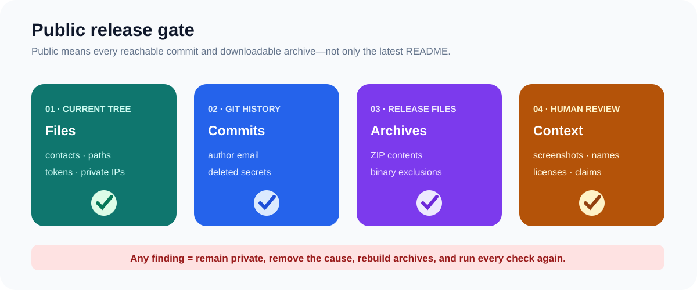

# Privacy checklist before making the repository public



The repository must remain private until every gate passes.

## Automated gates

```text
python scripts/validate_skills.py .
python scripts/check_links.py .
python scripts/package_skill.py --output dist/ue5-blueprint-troubleshooter.zip
python scripts/package_ue_demo.py --output-dir dist
python scripts/check_public_release.py . --history --archives dist
```

The release archives must be rebuilt from the checked source tree. Do not upload a locally packaged APK, executable, log directory, keystore, signing file, `.env`, original project asset, or editor cache.

## Human review

- Open every new SVG and screenshot at readable size.
- Check visible window titles, account names, paths, IP addresses, device names, notifications, and metadata.
- Confirm each asset is original or redistributable.
- Confirm claims distinguish inspected evidence, maintainer confirmation, clean-room reconstruction, and current verification.
- Confirm the public identity is only `JakeMorgan` with a GitHub noreply commit address.

Any finding blocks publication. Remove the cause, rebuild every archive, and repeat all gates.
