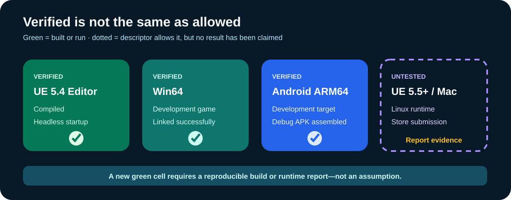

# Compatibility and verification matrix

This matrix separates verified results from untested compatibility. A source-level similarity or successful editor open is not a packaged-device result.

| Engine / target | Status | Evidence boundary |
| --- | --- | --- |
| UE 5.4 Editor, Win64 Development | Verified | Clean-room demo compiled on the inspected workstation |
| UE 5.4 Win64 game, Development | Verified | Target linked successfully |
| UE 5.4 Android ARM64, Development | Verified | Native target compiled and Debug APK assembled locally |
| UE 5.4 headless startup | Verified | `UnrealEditor-Cmd` entered game mode and exited successfully |
| UE 5.5+ | Untested | Contributor report required |
| Linux / macOS runtime | Untested | Plugin allowlist is not evidence of successful build or behavior |
| Store submission | Out of scope | Current store, signing, SDK, privacy, and policy requirements must be rechecked |

## Submit another result

Use the compatibility issue form or copy [the regression report template](REGRESSION_REPORT_TEMPLATE.md). Report the exact engine patch version, target, configuration, clean-room steps, outcome, and boundary of what was not tested.

Do not submit APKs, executables, device identifiers, account names, private paths, real LAN addresses, credentials, raw private logs, original project assets, or Marketplace content.
