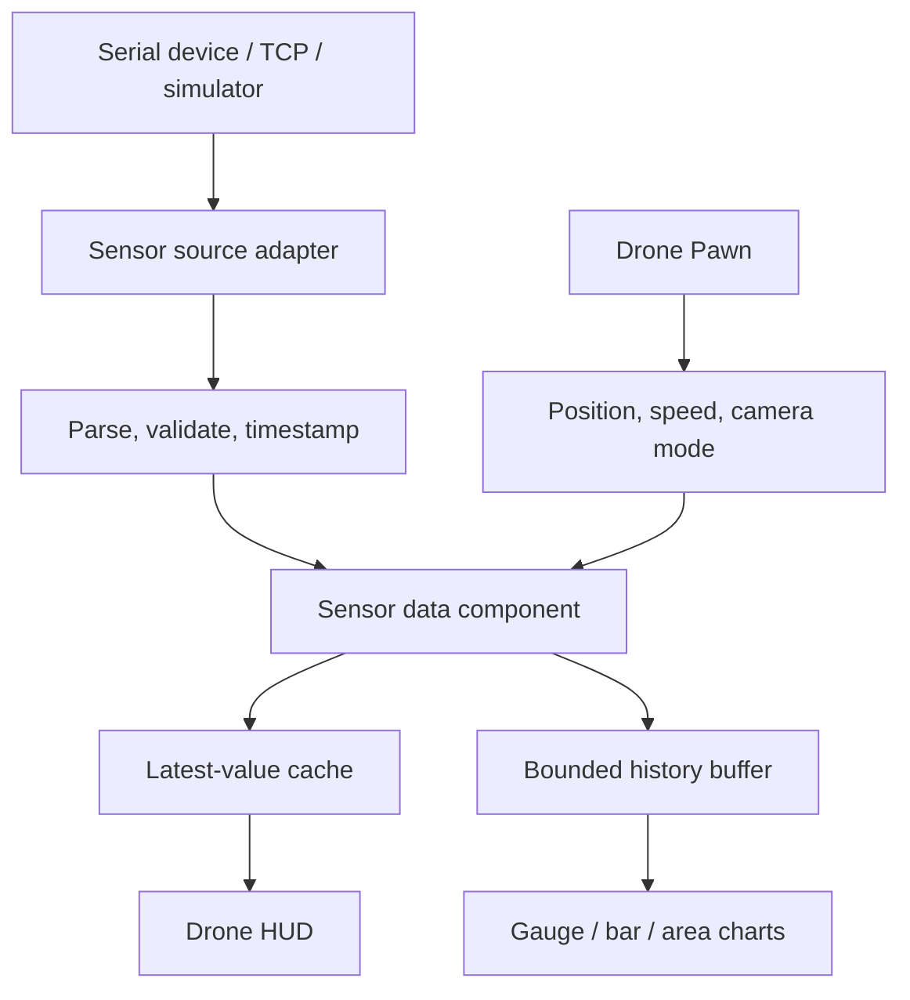

# Drone and multi-sensor Blueprint workflow

The inspected desktop project combined a drone Pawn, camera effects, a drone widget, serial/Arduino references, and gauge/bar/area charts. This guide turns those observations into a reusable architecture.

## Architecture



## 1. Drone Pawn responsibilities

Keep the Pawn focused on flight and camera state:

- movement input and acceleration;
- altitude and rotation constraints;
- camera component and camera-mode enum;
- optional sound component;
- collision and overlap events;
- telemetry output through an Event Dispatcher.

Example input flow:

```text
MoveForward axis
 -> Get Actor Forward Vector
 -> Multiply by Axis Value and configured speed
 -> Add Movement Input

Look input
 -> Apply yaw/pitch with sensitivity
 -> Clamp pitch
```

Do not read hardware sensors directly inside the drone Pawn. Inject normalized sensor data through a component or interface.

## 2. Camera modes

Use an enum such as `Normal`, `NightVision`, and `Thermal`.

```text
RequestCameraMode(NewMode)
 -> Is NewMode supported?
 -> Switch on camera mode
 -> Set post-process material/weight
 -> Update HUD label
 -> Broadcast CameraModeChanged
```

Store the authoritative mode explicitly. Avoid a chain of unrelated FlipFlops when more than two modes exist.

## 3. Sensor data model

Define a struct:

```text
ST_SensorSample
- SensorId: Name
- Metric: Enum
- Value: Float
- Unit: Name
- TimestampUtc: DateTime or numeric epoch
- Quality: Enum
- Source: Enum
```

Every source adapter converts incoming values into this struct. Validate finite values, known units, expected ranges, monotonic timestamps where required, and stale-data thresholds.

## 4. Serial/Arduino adapter

Recommended Blueprint flow:

```text
BeginPlay
 -> Enumerate or configure serial port
 -> Open port
 -> Bind data callback
 -> Start bounded reconnect policy

Data callback
 -> Append bytes to receive buffer
 -> Extract complete frame
 -> Parse sensor fields
 -> Validate and normalize
 -> Publish ST_SensorSample

EndPlay
 -> Unbind callback
 -> Close port
```

Never assume one serial callback equals one complete logical sample. Define framing and checksum rules for the device protocol.

## 5. Simulated data source

Hardware should not be required to develop the interface. Implement `BPC_SimulatedSensorSource` using a timer and deterministic seed.

```text
StartSimulation
 -> Set Timer by Event at configured sample interval

Timer event
 -> Generate bounded test values
 -> Publish through the same interface as the real adapter
```

Label simulated data clearly. Do not mix simulated output into recorded real experiments without provenance.

## 6. Chart update

Separate sampling rate from visual refresh rate:

```text
On Sensor Sample
 -> Update latest-value cache
 -> Append to bounded ring buffer

UI refresh timer at 5-20 Hz
 -> Read snapshot from cache/buffer
 -> Set gauge value
 -> Replace or append chart series
```

Avoid rebuilding large chart arrays on every frame. Cap history length and downsample long traces.

## 7. AI analysis boundary

If a widget sends sensor summaries to an AI service:

- obtain explicit user action before sending;
- send only the minimum necessary fields;
- remove personal, device, network, and project identifiers;
- display the request state and failure state;
- treat output as an interpretation, not a verified measurement;
- keep safety-critical control independent from AI output.

## 8. Verification

- disconnect and reconnect the serial device;
- inject malformed and out-of-range frames;
- verify stale values are visibly marked;
- compare displayed samples with a recorded fixture;
- test chart memory over a long run;
- package Windows and verify the plugin/runtime dependency is staged;
- verify the drone remains controllable when sensor input stops.
