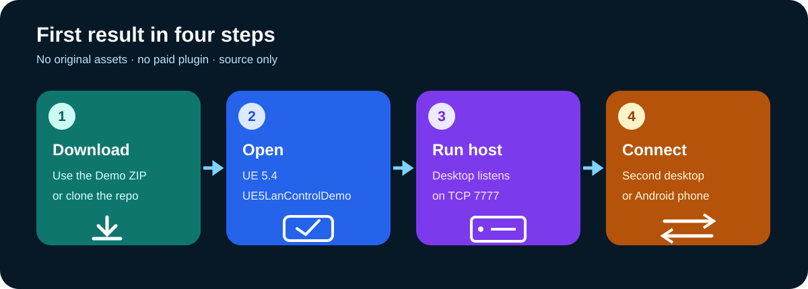
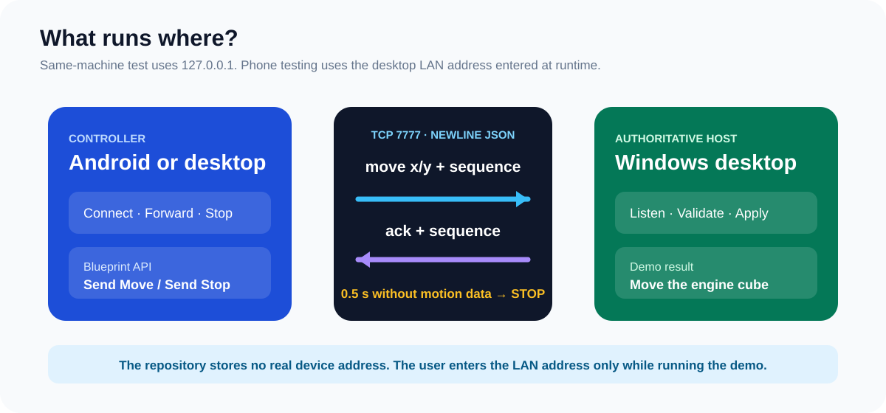
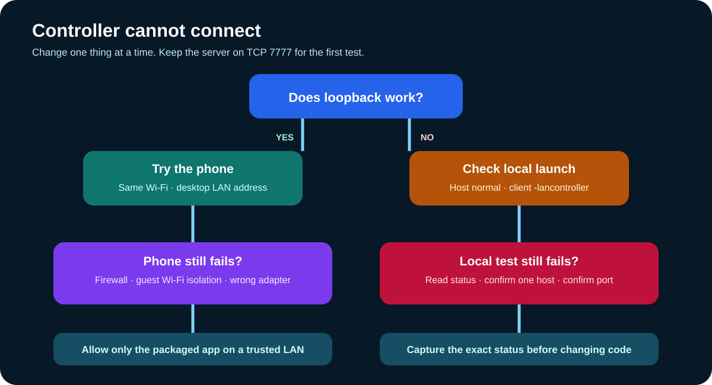

# Start here

## Pick one download

| Goal | Download | Open |
| --- | --- | --- |
| See the full result | `ue5-lan-control-demo-*.zip` | `UE5LanControlDemo.uproject` |
| Add LAN nodes to a project | `blueprint-engineering-toolkit-*.zip` | Copy the folder into `Plugins/` |
| Ask Codex to diagnose graphs | `ue5-blueprint-troubleshooter-*.zip` | Install it as a Codex Skill |

Use the [latest release](https://github.com/jakemorgan-research/ue5-blueprint-diagnostics-lab/releases/latest). Extract the demo near a drive root on Windows to avoid legacy path-length problems.

## Understand the two running sides

### Same computer

1. Run one normal instance: it becomes the host.
2. Run a second instance with `-lancontroller`.
3. Leave `127.0.0.1`, select **Connect**, then press and release a direction.

### Android phone

1. Run the Windows host.
2. Install your locally packaged Android build.
3. Put both devices on the same trusted Wi-Fi.
4. Enter the desktop's current LAN IPv4 address at runtime, then connect.

No real device address is stored in this repository or its release archives.

## If connection fails

Start with the same-computer test. It separates a project/runtime problem from firewall, Wi-Fi, and address-selection problems.

## Next page

- Need exact demo commands? Open the [demo README](../../examples/ue5-lan-control-demo/README.md).
- Need Blueprint node sequences? Open the [node library](NODE_LIBRARY.md).
- Need Android packaging? Open the [Android guide](ANDROID_PACKAGING.md).
- Need to adapt the protocol? Open the [control protocol](CONTROL_PROTOCOL.md).
