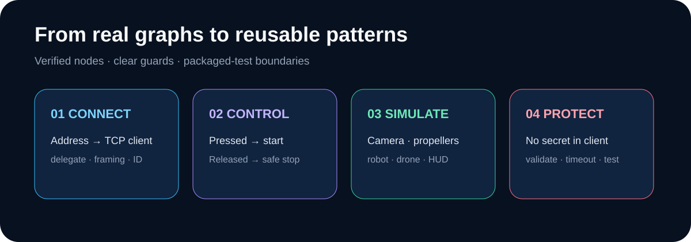
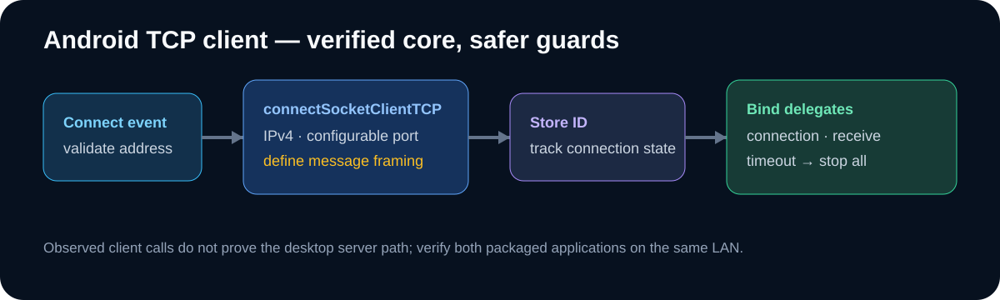
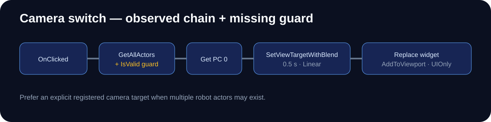
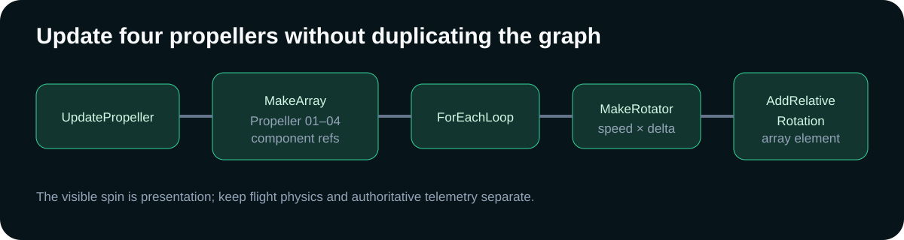

# Evidence-backed UE5 Blueprint node library



This library translates inspected UE 5.4 Blueprint graphs into reproducible teaching sequences. Plugin labels can vary by version. Values marked **example** are configurable; runtime behavior still needs packaged testing.

## 1. Enter and store the desktop address

```text
IP Text Box: OnTextCommitted
 -> Conv_TextToString
 -> Set ServerIP

Confirm Button: OnClicked
 -> RemoveFromParent
 -> GetPlayerController(0)
 -> SetInputMode_GameOnly
 -> Set bShowMouseCursor = false
```

| Node | Purpose | Common beginner trap |
| --- | --- | --- |
| `OnTextCommitted` | Captures completed text entry | Treating every keystroke as a connection attempt |
| `Conv_TextToString` | Converts UMG text to the socket string input | Forgetting to trim spaces or validate the address |
| `SetInputMode_GameOnly` | Returns controls to the game after confirmation | Removing the widget but leaving keyboard focus in UI mode |

Safer addition: validate address and port, display a readable error, and keep the connection button disabled while a connection attempt is active.

## 2. Connect the Android TCP client



```text
Connect custom event
 -> connectSocketClientTCP
      Domain or IP = stored ServerIP
      Port = 5656 (observed example; make configurable)
      IP Type = IPv4
      Receive Filters = SAB
      Message Separator = None
 -> store returned Connection ID
 -> bind TCP connection event
 -> bind TCP receive-message event
```

The observed graph used no message separator. That can make framing ambiguous because TCP is a byte stream. The public reconstruction instead recommends newline-delimited JSON or a length prefix, configured identically on both ends.

## 3. Send press and release commands

```text
Button OnPressed
 -> socketClientSendTCP(ConnectionID, StartCommand, AddLineBreak=true)

Button OnReleased
 -> socketClientSendTCP(ConnectionID, StopCommand, AddLineBreak=true)
```

The inspected widget contains numeric command strings from `10` through `29`, but the exact mapping is not asserted here. Replace duplicated literal strings with an enum/struct and one `SendCommand` function.

Minimum safe behavior:

- reject sends unless the connection state is Connected;
- stop all active movement on disconnect or heartbeat timeout;
- rate-limit repeated controls;
- validate again on the desktop;
- log symbolic action names, not credentials or personal network details.

## 4. Switch from controller UI to a robot camera



```text
Camera Button OnClicked
 -> GetAllActorsOfClass(Robot)
 -> Get(Array, Index=0)
 -> IsValid
 -> GetPlayerController(0)
 -> SetViewTargetWithBlend
      NewViewTarget = Robot actor
      BlendTime = 0.5
      BlendFunc = Linear
      LockOutgoing = false
 -> RemoveFromParent
 -> CreateWidget(next UI)
 -> AddToViewport
 -> SetInputMode_UIOnlyEx
```

The inspected graph selected array index zero. Add `IsValid`, handle an empty array, and prefer a stored reference, tag, interface, or explicit registration when multiple robot actors can exist.

## 5. Rotate four drone propellers



```text
UpdatePropeller
 -> MakeArray(Propeller_01, Propeller_02, Propeller_03, Propeller_04)
 -> ForEachLoop
 -> MakeRotator(axis delta from PropellerSpeed)
 -> AddRelativeRotation(Array Element)
```

Use a delta based on elapsed time if speed is expressed per second. Avoid multiplying rotation by frame rate, and do not use the visual propeller spin as the authoritative flight-physics state.

## 6. Align drone yaw with the active camera

```text
SetFollowCameraRotation
 -> GetPlayerCameraManager(0)
 -> GetCameraRotation
 -> BreakRotator
 -> MakeRotator(keep desired axes)
 -> SetActorRotation
```

Decide explicitly whether pitch and roll should be preserved. For smooth following, interpolate toward the target rotation and document whether this function runs on Tick, a timer, or an input event.

## 7. Process an HTTP/JSON response safely

The inspected graph used a request object, completion delegate, and nested JSON fields. Its credential storage was unsafe; use the corrected boundary below.

```text
User action
 -> Build minimal request payload
 -> Send to your controlled gateway (no provider secret in UE)
 -> Bind completion delegate
 -> Check transport success and HTTP status
 -> GetResponseObject
 -> GetObjectArrayField("choices")
 -> Get(Array, 0) with length guard
 -> GetObjectField("message")
 -> GetStringField("content")
 -> StringToText
 -> SetText
```

Never put a provider credential in a Blueprint default, packaged config, command line, screenshot, or repository secret masquerading as client protection. See [Security remediation](SECURITY_REMEDIATION.md).

## 8. Node review checklist

- What triggers this graph?
- Which object owns each stored reference, and how long does it live?
- What happens when an array is empty or a reference is invalid?
- Is the callback on the game thread?
- Does the graph frame, validate, and rate-limit external input?
- What stops motion after focus, network, or app lifecycle loss?
- Does the packaged build behave the same as PIE?
- Could any default value expose a credential, address, device ID, or personal path?
