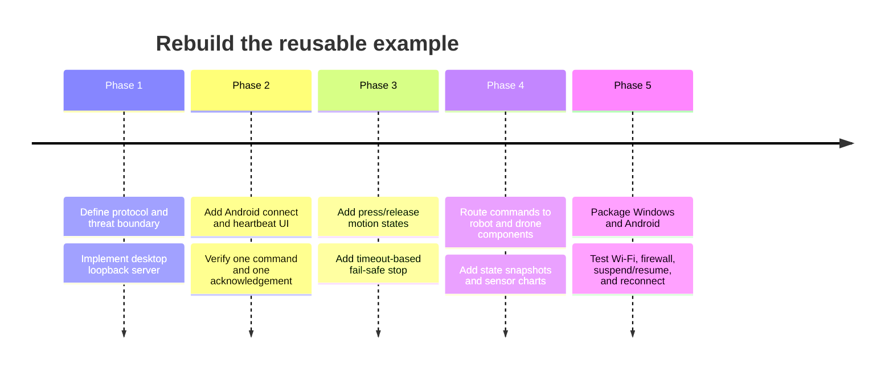

# Redacted UE project case study

## Scope and evidence levels

This case study describes reusable engineering ideas from two privately held Unreal Engine projects. No original `.uasset`, `.umap`, configuration, log, executable, APK, screenshot containing private data, or third-party asset is included.

- **Observed:** visible in project structure, configuration, package output, editor UI, or Blueprint asset metadata.
- **Reconstruction:** a clean-room implementation that developers can reproduce without the original project.
- **Packaged artifact verified:** a Shipping output exists on the inspected workstation.
- **Maintainer-confirmed runtime:** the maintainer reports completing the packaged two-device workflow; private logs are excluded.

## Project relationship

The larger desktop project is a smart-materials and digital-experiment platform. Its feature families include:

1. metallography and laboratory training;
2. drone inspection and multi-sensor visualization;
3. industrial robot and IoT-style control.

The smaller project is an Android-focused derivative centered on robot control. Android ARM64 package artifacts were present. Windows staging artifacts also existed, so it should be described as Android-focused rather than Android-only.

Both project descriptors and recent logs identify UE 5.4, even though a later engine is installed on the workstation. Opening with the matching engine avoided an accidental asset conversion.

## Observed Blueprint features

### Desktop platform

- a menu that opens laboratory, sensor, database, and other functional views;
- a drone Pawn with camera, movement input, post-process modes, sound, and a drone widget;
- sensor widgets with gauge, bar, and area series;
- serial/Arduino Blueprint references;
- industrial environment, laboratory, robot, waypoint, web, and database-related assets;
- packaged Windows output.

### Android controller

- an editable field asking for the desktop computer's IP on the phone's current subnet;
- TCP client connect, send, connection-event, and receive-event nodes;
- a client connection ID retained after connecting;
- controls for Forward, Back, Left, Right, Base, and JointA through JointE;
- separate `OnPressed` and `OnReleased` events for continuous controls;
- speed adjustment, camera switching, and camera zoom;
- packaged Android ARM64 output.

## Engineering lessons

1. **Use the engine version recorded by the project.** Upgrade only a copied branch and package representative targets before accepting the migration.
2. **Treat a phone button as a state transition.** `OnPressed` starts an action and `OnReleased` stops it. A click-only graph can leave motion active after packet loss or focus changes.
3. **Frame TCP messages.** TCP is a byte stream; one send does not guarantee one receive callback. Use a delimiter or length prefix consistently on both ends.
4. **Keep desktop state authoritative.** Validate command type, target, value, rate, and client session before modifying a Pawn or robot.
5. **Separate transport from simulation.** A connection component receives messages; a command router parses them; domain components move the drone or robot; widgets only display and request state.
6. **Do not drive network and sensor work from frame Tick by default.** Use callbacks for incoming data and timers for deliberate sampling or UI refresh rates.
7. **Test packaged applications.** PIE success does not prove Android permissions, Windows firewall, plugin staging, network interface binding, or lifecycle behavior.

## Faults found during inspection

- A metallography widget retained a drone-specific status string, indicating copy/paste residue.
- A menu graph contained disabled or disconnected logic.
- The Android package identifier was still a template placeholder.
- Android target SDK settings were old and should be revalidated for the current distribution channel.
- Public Android logging was enabled in project settings.
- Closing a UMG editor triggered an editor assertion involving a standalone asset-editor toolkit. The crash report was not uploaded because logs can include personal data.

These observations are useful review prompts, not proof that every packaged runtime path fails.

## Safe reconstruction timeline

## Runtime completion and disclosure boundary

Windows and Android Shipping artifacts were verified on the inspected workstation. The maintainer confirms that the packaged phone controller and desktop application completed the intended LAN workflow on real devices.

The public case study does not disclose or generalize:

- the exact original desktop server Blueprint asset and its final port;
- the original wire format used by every control button;
- whether all three feature families were included in the same final package;
- behavior across every Android device and network.

The guides therefore use an explicit, versioned example protocol rather than disclosing private defaults. These boundaries do not block the documentation and Skill release.
