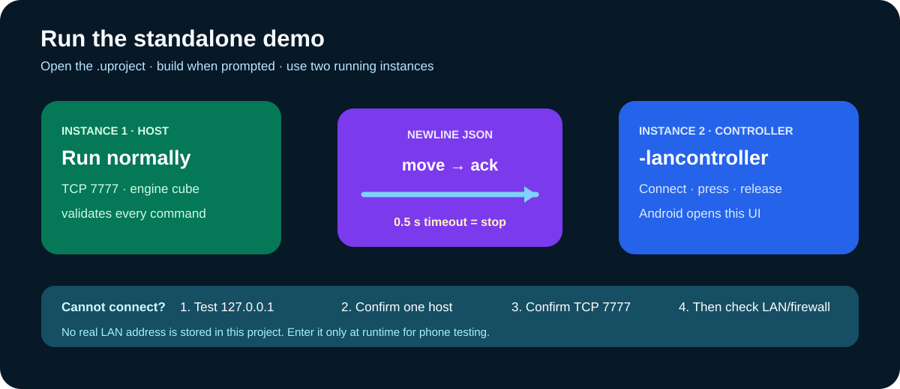

# UE5 LAN Control Demo

This is a clean-room, code-only UE 5.4 sample. It contains no original project asset, private address, credential, log, APK, executable, or Marketplace dependency.



The runnable code was compiled with UE 5.4 as an Editor target, a Win64 Development game, and an Android ARM64 Development game. Debug APK assembly also completed successfully; generated binaries are deliberately not included in the repository or source archives.

## What developers can use

- `Plugins/BlueprintEngineeringToolkit`: copy this folder into another UE5 project's `Plugins` directory.
- `UE5LanControlDemo.uproject`: open the complete minimal demonstration.
- Blueprint-callable nodes: start server, connect client, send move, send stop, disconnect, connection events, command events, and status events.
- A desktop host and an Android/desktop controller UI built without private content assets.

## Fastest desktop test

1. Open the project in UE 5.4 and build the Editor target when prompted.
2. Run the project normally: it starts a TCP server on port `7777`.
3. Launch a second instance with `-game -lancontroller`.
4. Keep `127.0.0.1`, select **Connect**, then hold and release the direction buttons.
5. The cube in the server instance moves and stops through the newline-delimited JSON protocol.

Expected screen roles:

| First instance | Second instance |
| --- | --- |
| Engine cube and server status | Address box, Connect button, direction buttons |

On Windows, extract or clone the project near the drive root if the full path is very long. Some UE toolchain operations still encounter the legacy 260-character path boundary.

## Android test

Package the same project for Android ARM64. Android automatically opens the controller interface. Enter the desktop's current private-LAN IPv4 address, connect, and use the press/release buttons. Permit the desktop build through the local firewall only on a trusted network.

The generic package identifier is `com.example.uelancontroldemo`; replace it before distributing an application. Revalidate current Epic, Android SDK, signing, and store requirements for the selected engine and channel.

## Blueprint route

In any Blueprint, get `Blueprint Lan Subsystem` from the Game Instance and call:

```text
Desktop BeginPlay -> Start LAN Server(7777)
Android Connect   -> Connect To LAN Server(Address, 7777)
Button Pressed    -> Send Move Command(Axis)
Button Released   -> Send Stop Command
Desktop Event     -> On Move Command -> apply validated movement
```

The demo protocol is intentionally small and unauthenticated. Use it only on a controlled LAN. A built-in 0.5-second motion timeout stops the actor if fresh movement commands stop arriving, but production systems should also add authentication, authorization, rate limits, telemetry validation, and transport security appropriate to their threat model.

## Build from the command line

```text
<UE_5.4>/Engine/Build/BatchFiles/Build.bat UE5LanControlDemoEditor Win64 Development <absolute-path>/UE5LanControlDemo.uproject -WaitMutex
```

Generated `Binaries`, `Intermediate`, `Saved`, project files, APKs, and executables stay outside version control.

## Copy only the plugin

```text
YourProject/
└─ Plugins/
   └─ BlueprintEngineeringToolkit/
      ├─ BlueprintEngineeringToolkit.uplugin
      └─ Source/
```

Restart the editor, allow the module to compile, then obtain `Blueprint Lan Subsystem` from the Game Instance in Blueprint. The [node library](../../docs/ue5/NODE_LIBRARY.md) lists every public node and event.
